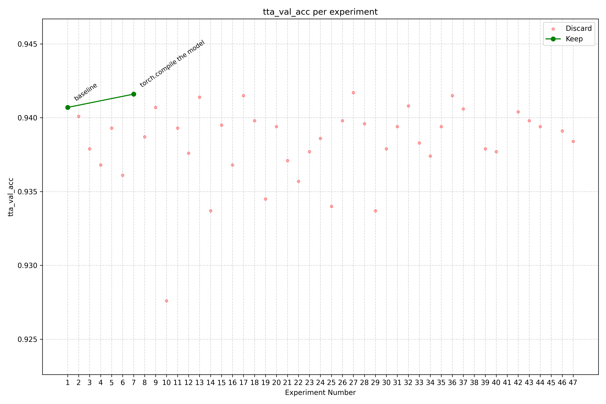

# autoresearch

An autonomous research loop adapted from [Karpathy's autoresearch](https://github.com/karpathy/autoresearch) and applied to CIFAR-10 image classification. The baseline is a fork of [hiverge/cifar10-speedrun](https://github.com/hiverge/cifar10-speedrun), a network that trains to ~94% top-1 accuracy on CIFAR-10 in 2 seconds on an A100, split into two files: `prepare.py` (data loading, augmentation, evaluation; read-only) and `train.py` (model, optimizer, training loop; the only file the agent edits). Each experiment runs for a fixed 7-minute time budget on a single local NVIDIA GTX GPU, and the agent iterates: tweak `train.py`, run, measure `tta_val_acc`, keep if better / discard if not, repeat. Instructions for the agent live in `program.md`; per-experiment results are appended to `results.tsv` (untracked).

## Setup

### The baseline

The starting point is [hiverge/cifar10-speedrun](https://github.com/hiverge/cifar10-speedrun): a single Python file that trains a small CNN to ~94% top-1 accuracy on CIFAR-10 in ~2 seconds on an A100. Everything lives in `cifar10_speedrun.py`: data download, augmentation, model, the Muon optimizer, the training loop, test-time augmentation, and a 200-run seed-averaging loop (evaluation). That single file is the baseline this project iterates on.

### Hardware and the changes it forced

Training runs on a single local GPU:

```
Sun May  3 22:15:24 2026
+-----------------------------------------------------------------------------------------+
| NVIDIA-SMI 550.163.01             Driver Version: 550.163.01     CUDA Version: 12.4     |
|-----------------------------------------+------------------------+----------------------+
| GPU  Name                 Persistence-M | Bus-Id          Disp.A | Volatile Uncorr. ECC |
| Fan  Temp   Perf          Pwr:Usage/Cap |           Memory-Usage | GPU-Util  Compute M. |
|                                         |                        |               MIG M. |
|=========================================+========================+======================|
|   0  NVIDIA GeForce GTX 1650        Off |   00000000:01:00.0 Off |                  N/A |
| N/A   36C    P8              4W /   50W |       6MiB /   4096MiB |      0%      Default |
|                                         |                        |                  N/A |
+-----------------------------------------+------------------------+----------------------+

+-----------------------------------------------------------------------------------------+
| Processes:                                                                              |
|  GPU   GI   CI        PID   Type   Process name                              GPU Memory |
|        ID   ID                                                               Usage      |
|=========================================================================================|
|    0   N/A  N/A      1163      G   /usr/lib/xorg/Xorg                              4MiB |
+-----------------------------------------------------------------------------------------+
```

That is a GTX 1650: 4 GB of VRAM. The recipe as shipped does not run on it. Two adjustments were enough to make it work:

1. **All `torch.compile` was stripped out.** The original aggressively wraps the forward step, the augmentation kernels, and the TTA path in `@torch.compile(mode="max-autotune", ...)`, and also calls `model.compile(...)` in `__main__`. On my local GPU, `max-autotune` either fails or spends so long autotuning that compilation eclipses the actual training. Removing every `@torch.compile` decorator (and the `model.compile` call) is what made the code execute end-to-end. The cost is real: compilation is a large fraction of the speedrun's win, but a non-running baseline is not a baseline. :)
2. **TTA batch sizes were reduced from 2000 to 250.** During inference the original splits the test set into 2000-image chunks; that does not coexist with the model on 4 GB. Lowering the test, initial-TTA, and uncertain-TTA batch sizes to 250 fits the GPU. Because the model is in `eval()` and the forward pass is deterministic per sample, accuracy is unaffected.

The 200-run seed-averaging loop in the original was also removed (due to time budget constraints), although I understand that there is a huge drawback to this.

### Splitting one file into two

Once the baseline ran, the single file was split into two:

- **`prepare.py`**: data download and caching, the `CifarLoader`, augmentation kernels, evaluation, and the constants that govern them.
- **`train.py`**: the Muon optimizer, the network, the training loop, and the `__main__` entry point.

The reason is that the autoresearch loop lets an agent edit the training recipe and judges its work by the resulting evaluation metric (`tta_val_acc` in this case). If the agent could touch the data pipeline or the evaluation code, "improving" the metric would be trivial: weaken augmentation, change the test split, redefine accuracy. The split puts a hard wall between **what the agent is allowed to modify** (`train.py`) and **what stays frozen** (`prepare.py`). The metric is only meaningful because the thing computing it is off-limits.

### Experiment budget

Each experiment trains for a fixed **7-minute wall-clock budget** and is then evaluated. The agent edits `train.py`, runs it once, reads `tta_val_acc`, and decides whether to keep the change. Two notes:

- **Why 7 minutes.** The original speedrun targets seconds on an A100. On a GTX 1650, the same recipe needs minutes to reach a meaningful accuracy. Seven minutes is long enough that the baseline trains to convergence, and short enough that an agent can run dozens of experiments per session.
- **One seed per experiment, for now.** Each experiment is a single run, not an averaged multi-seed estimate. Run-to-run variance is therefore real, and small `tta_val_acc` deltas should not be treated as conclusive. Multi-seed averaging is left as future work: averaging over N seeds would multiply every experiment's runtime by N, which is too slow given how fast the autoresearch loop needs to iterate on a single GTX. For now, the loop optimizes a noisy single-seed objective on purpose, accepting some false positives in exchange for a much faster feedback cycle. And to be frank, this was done quickly this way to see what the loop would output - the autoresearch tool was the main focus.

## Results

<p align="center">
  
</p>

As expected, there was not a lot of room for the agent to improve on: the baseline is already tightly tuned, and the margins were narrow before the loop even started. Despite that, the agent did find a few tweaks that produced a better `tta_val_acc` than the baseline. Whether those gains are real is something I cannot judge yet from this run alone: they may be genuine, or they may be partly an artifact of the changes I made manually while adapting the script to my hardware (notably stripping `torch.compile`). To know for sure, the modified `train.py` needs to be run through the original 100- or 200-seed averaging loop and compared against a baseline measured the same way. That is on the to-do list.

The more interesting takeaway, for me, is what the loop demonstrated about the agent itself. It was able to read the code, form hypotheses, make targeted changes, run them, and react to the results. The changes it tried were sensible, not random. It will not produce research breakthroughs, at least not yet, but a tool that can iterate like this is already useful for the parts of the dev process where iteration is the bottleneck: optimizing training loops, sweeping hyperparameters, surfacing bugs you stopped paying attention to, etc. That is what I wanted to see from this experiment, and I got it.

I plan to keep using this on personal work where it fits, and to push further updates to `main` as they happen.
