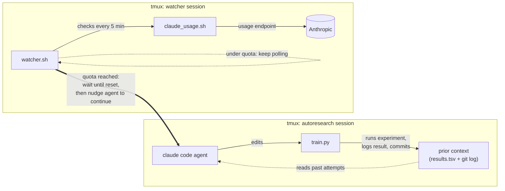

# autoresearch

An autonomous research loop adapted from [Karpathy's autoresearch](https://github.com/karpathy/autoresearch) and applied to CIFAR-10 image classification. The baseline is a fork of [hiverge/cifar10-speedrun](https://github.com/hiverge/cifar10-speedrun), a network that trains to ~94% top-1 accuracy on CIFAR-10 in 2 seconds on an A100, split into two files: `prepare.py` (data loading, augmentation, evaluation; read-only) and `train.py` (model, optimizer, training loop; the only file the agent edits). Each experiment runs for a fixed 7-minute time budget on a single local NVIDIA GTX GPU, and the agent iterates: tweak `train.py`, run, measure `tta_val_acc`, keep if better / discard if not, repeat. Instructions for the agent live in `program.md`; per-experiment results are appended to `results.tsv` (untracked).

## On the task

I'll be upfront: CIFAR-10 isn't the task to pick if you want headline results. Image classification on this dataset has been pushed to the point where the active frontier is _speed_, not accuracy anymore, and I'm running on a single NVIDIA GTX card, there's nothing to meaningfully compare my numbers against. A single seed run already takes ~8 minutes, so I capped the time budget at 7 and hoped the loop could nudge past the baseline it set on the first pass.

I also know the noise floor here is a bit high. To make the comparison honest, each variant should be averaged across many seeds, but I don't have the compute or the experiment-time budget for that. So this is mostly curiosity: I wanted to see what would come out the other end. The margins are already tight and the absolute numbers in this specific case don't really matter to me. What I care about is that the loop runs _autonomously_, on my Claude Pro subscription, for as long as the plan allows. Even if it never makes a breakthrough on this specific task, the same setup can chip away at real work I'm doing: surfacing improvements, catching bugs I missed, exploring directions I wouldn't have time to try by hand. That's the part I'm here for, the rest is just curiosity.

## On the loop

Quick context before the technical bit: I'm not someone who leans heavily on AI for my work, but I do think it's a tool worth exploiting properly when it fits (this is a different topic tho). I'd already played with Claude Code on a friend's subscription, right around when it came out, and between the recent noise around Anthropic's models and Karpathy's autoresearch project, the idea for this just clicked. I didn't run the numbers myself, but even with the hourly and weekly budgets I think you'd get a great return on AI investment out of something like this XD.

Long story short, the constraint that shaped this: I had Claude Code on a Pro subscription, and I didn't want to leave any of the included usage on the table. So I built something that just keeps going.

The agent runs until it hits the usage limit, the watcher notices, sleeps until the quota resets, and then nudges the loop to continue. It runs by itself across reset windows, indefinitely.

I'll admit the timing is funny; I'm releasing this roughly when Anthropic decided to drop Claude Code from the Pro plan. Although the plan from the very beginning was to port the same idea on top of a different harness ([opencode](https://opencode.ai/), [pi](https://pi.dev/), something in that direction). I'm currently open to target whatever harness people actually want (based on demand), so open an issue if you have a preference and this project interests you! Do it also if you have suggestions, or bugs to flag.

## Architecture

It's deliberately simple.

**Requirements:** Claude Code with a Pro subscription, and tmux. (If you have API access, you don't need any of this, Karpathy's original is enough.) Run in a sandboxed environment.

**Setup:**

1. Open a tmux session name it whatever (e.g. `autoresearch`), start `claude` inside it with permission prompts disabled, and detach.
2. From a second session, `chmod +x watcher.sh claude_usage.sh` and run `./watcher.sh`.

**What the watcher does:** every 5 minutes it polls Claude Code's usage. When utilization is at the cap, it sleeps until the reset timestamp, then `tmux send-keys` a "continue" prompt into the agent's session, and the loop picks back up. Not super clean but it nails the job.

The "how do you read usage?" part: it's an undocumented endpoint. You can pull it out yourself by running Claude Code through a debug proxy (I used mitmproxy in my case), invoking the `/usage` command, and reading the request off the wire. `claude_usage.sh` wraps that endpoint and returns the utilization percentage and reset time as JSON.

## Status and contributions

I'll keep iterating on this until it either lands somewhere I'm happy with or I find a harness that works better and rebuild on top of it. Either way I'll be using it for my own work and will post back with whatever comes out.

Issues, PRs, and discussion are all welcome - particularly if you have:

- a harness you'd like this ported to,
- ideas for the CIFAR-10 setup itself (see below),
- or anything you've learned running similar loops.

### On the experiment design specifically

I said the task results don't matter much to me, but I am curious what people who've done this seriously would do differently. My honest read: a stronger GPU plus per-variant seed averaging would obviously be the right move, but with my hardware that would mean drastically fewer experiments per reset window, and "lots of cheap experiments" is the entire reason for using a loop like this. So I kind of traded statistical rigor for throughput, knowing it's a compromise. I'm not pretending that's the principled choice - if you'd weigh it differently or see a smarter middle ground, I'd genuinely like to hear it.
